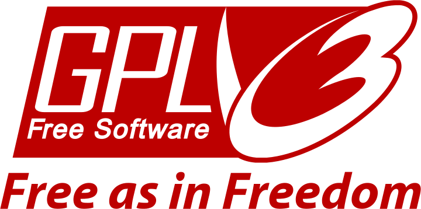

# Deliverable 1

## Introduction/project description

Every operating system ever invented has come with different types of usage, strength and purpose. The most common operating systems we know off as of today include Microsoft Windows, macOS and Linux. In this project I will be informing you more on the operating system Linux and demonstrating how to use Ubuntu as your everyday operating system as it is considered to be a good distribution for beginners.

## Project hardware and software requirements

* **Hardware**: A computer that can virtualize 
* **Software**: A hypervisor installed, also known as a Virtual Machine or VM

## What is Linux?
Linux is an operating system, similar to Windows, iOS, and Mac OS. In actuality, the Linux operating system is used by one of the most popular platforms in the world, Android. An operating system is a piece of software that oversees all of the hardware resources on your computer or laptop. Simply explained, the operating system is in charge of managing communication between your program and your hardware. The software would be useless without the operating system (OS).

### Short history of linux

Unix is one of the most popular operating systems worldwide because of its large support base and distribution. It was originally developed as a multitasking system for minicomputers and mainframes in the mid-1970s. It has since grown to become one of the most widely used operating systems anywhere, despite its sometimes confusing interface and lack of central standardization.

Linus Torvalds began working on Linux in 1991 while a student at the University of Helsinki in Finland, and it is now a freely distributable version of Unix, He unwittingly spawned one of the largest software-development phenomenon of all time when he published the first version of Linux for free on the Internet. Today, Linux is a full-fledged Unix clone, capable of running everything from the X Window System to TCP/IP, Emacs, Web, mail, and news services. Almost every important piece of free software has been ported to Linux, and commercial software is becoming more widely available.

        
---------------------

## Linux distribution

A Linux distribution is an operating system with layers and layers stacked on top of one another.
The Linux kernel, GNU tools, libraries, Software, Windowing System, and Window Manager are all at the bottom of the stack. The Desktop Environment is the most top-level layer. It's a free operating system that competes with Windows and Mac OS X. 

Linux distributions combine open source code into a single operating system that can be installed and started.
Linux distributions are available for desktop computers, non-graphical servers, supercomputers, mobile devices, and niche applications including home theater PCs and embedded systems. 

**SLACKWARE**
Originally developed by Linus Torvalds in 1991, the UNIX-like Linux operating system now benefits from the contributions of millions of users and developers around the world. Slackware Linux provides new and experienced users alike with a fully-featured system, equipped to serve in any capacity from desktop workstation to machine-room server. Web, ftp, and email servers are ready to go out of the box, as are a wide selection of popular desktop environments. A full range of development tools, editors, and current libraries is included for users who wish to develop or compile additional software.

**DEBIAN**
Debian is a popular and freely available computer operating system (OS) that uses a Unix-like kernel alongside other program components, many of which come from GNU Project. Since its introduction, Debian Project has continued to operate as an all-volunteer organization dedicated to providing free open source software.

#### Debian Based Distributions

* **UBUNTU** 
Ubuntu is a complete Linux operating system that is accessible for free and has both community and professional support.
The Ubuntu community is based on the Ubuntu Manifesto's ideas that software should be available for free, that software tools should be accessible to people in their native language and regardless of disabilities, and that people should be able to customize and alter their software in any way they see fit. 

* **KALI LINUX**

Kali Linux is a Debian-based Linux distribution that comes pre-installed with a number of tools to assist with information security activities such as ethical hacking. It was created by Offensive Security, a well-known information security company. 

---

#### RED HAT ENTERPRISE LINUX
Red Hat is a tech company that sells a distribution package that includes open source Linux operating system components and related tools.
The business model is founded on an open source environment in which collaborative development takes place within a community of professionals dedicated to quality assurance, testing, and customer service.
DevOps engineers and enterprises use a variety of open source tools from Red Hat. Operating system platforms, storage, middleware, administration solutions, and training, support, and consulting services are among them.

### RHEL Based Distributions

**FEDORA**
Fedora creates an innovative, free, and open source platform for hardware, clouds, and containers that enables software developers and community members to build tailored solutions for their users.

----
# Open Source VS Closed Source

## Open Source
The word "open source" initially referred to open source software (OSS).
Anyone can examine, alter, and share open source software, which is code that is supposed to be publicly accessible. Peer review and community production are used to build open source software in a decentralized and collaborative manner. Because open source software is produced by communities rather than a single author or organization, it is frequently less expensive, more flexible, and has a longer lifespan than proprietary software.

### Advantages of Open Source
* Freedom and Flexibility
* Security
* High Quality

### Disadvantages of Open Source
* Hidden Costs
* Compatibility issues
* Difficulty of use

### Example of Open Source Software
| Software        | License                | Logo                    |
| --------------- | ---------------------- | ----------------------- |
| Mozilla Firefox | Mozilla Public license |  |
| Libreoffice     |Mozilla Public License Version 2.0|
| VLC media player|GNU General Public License||
| Python          |OSI-approved open source license| |

## Closed Source
Closed source software is computer software with a closed source code, which means that the public does not have access to the source code.
CSS stands for Cascading Style Sheets.The source code is protected in closed source software. The software can only be changed by the person or group who generated it. Closed source software is expensive, and users must obtain a valid and validated license in order to use it. As it gives an authenticated license, it also imposes a number of limitations on users in terms of program use and modification. 

### Advantages of Closed Source
* User friendly
* Updates
* Troubleshooting

### Disadvantages of Closed Source
* Cost
* Adaptation
* Licensing

### Example of Closed Source Software 
| Software  | License | Logo |
| ----------| ------- | ---- |
| Virtual Box|GNU General Public License, v2||
| Java      | Oracle JDK | 
|Adobe Flash|Freeware|
|winRAR     |Trialware | 

## The Free software movement
 The free software movement is a social movement with the goal of obtaining and guaranteeing certain freedoms for software users, namely the freedoms to run the software, to study the software, to modify the software, and to share copies of the software. Software which meets these requirements is termed free software.

### The 4 freedoms

* Freedom 1: **The freedom to inspect or view.** In software, this came from the freedom to study how the program works, and change it to make it do what you wish . Access to the source code is a precondition for this - such as FreeCAD files, text documents, spreadsheets, calculations, instructions, etc.
* Freedom 2: **The freedom to use.** Run or otherwise execute the software, product, or process. You may be charged for using the thing. But this is a moot point, because as soon as someone buys it, it can be released for free.
* Freedom 3: **The freedom to modify.** This is a big point: making improvements or adaptation is a key to distributing value.
* Freedom 4: **Economic freedom.** The freedom to distribute or sell. Freedom distribute copies of your modified versions to others. By doing this you can give the whole community a chance to benefit from your changes. Access to the source code is a precondition for this. 

### The GPL License 

The GNU General Public License (GNU GPL) is a copyleft-free license for software and other works. Most software and other practical works come with licenses that restrict your ability to share and modify them. The GNU General Public License, on the other hand, is designed to ensure that you have the freedom to share and modify all versions of a program, ensuring that it remains free software for all users. The GNU General Public License is used by the Free Software Foundation for the majority of its software; it also applies to any other work released in this manner by its creators.
You can use it in your own programs as well. 

## Sources

* [What is Linux](https://www.linux.com/what-is-linux/)
* [History of Linux](https://www.oreilly.com/library/view/running-linux-third/156592469X/ch01s02.html)
* [Linux Distributions](https://www.suse.com/suse-defines/definition/linux-distribution/)
* [Open vs Closed Source Softwares](https://www.nibusinessinfo.co.uk/content/disadvantages-open-source-software)
* [Free software movement](https://en.wikipedia.org/wiki/Free_software_movement)
* [The 4 freedoms](https://wiki.opensourceecology.org/wiki/4_freedoms)
* [GPL](https://www.gnu.org/licenses/gpl-3.0.en.html)
* 