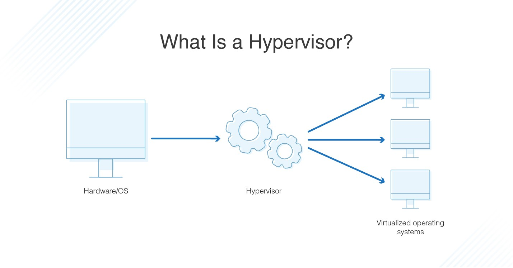
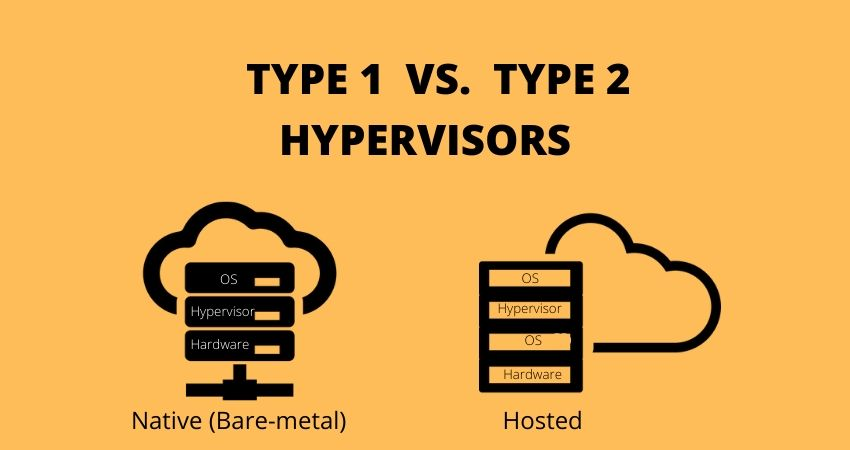
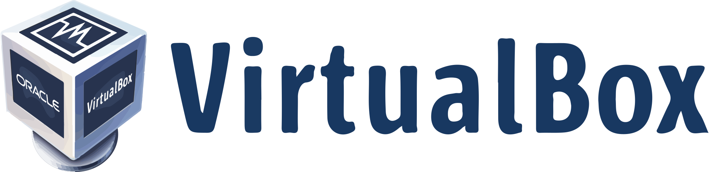
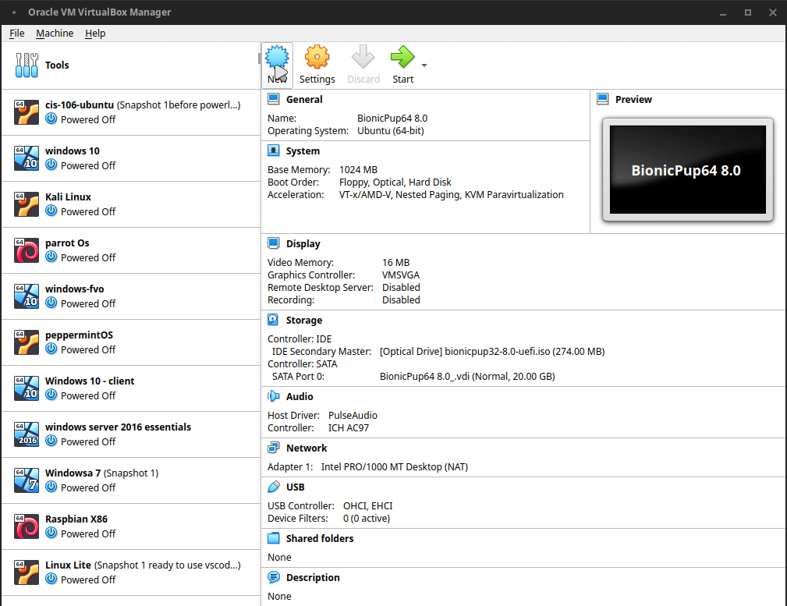
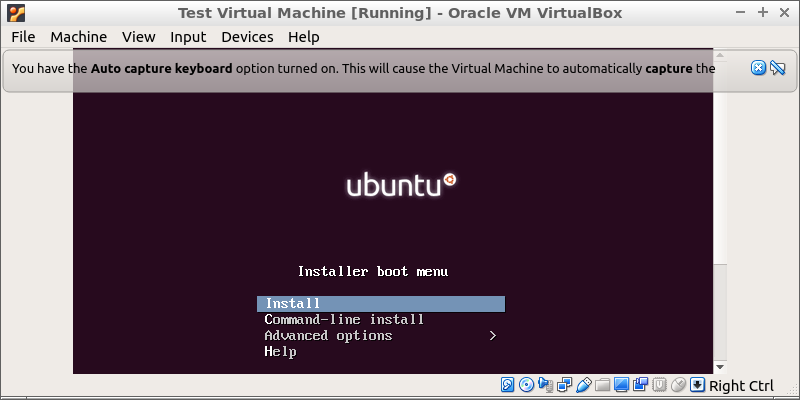
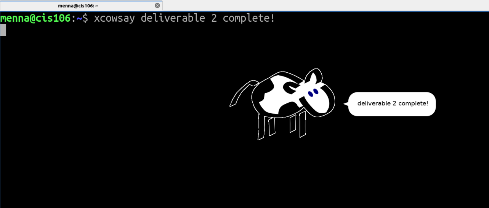

# Deliverable 2

------

## What is Virtualization?

Virtualization is a technique that allows you to construct valuable IT services without having to rely on hardware. It lets you to make full advantage of a physical machine's capabilities by distributing them across multiple users or contexts.

### Types of virtualization
**Client side virtualization**: Client-side virtualization uses a remote desktop protocol to transfer pictures from central servers to desktops. 

**Server side virtualization**: By using a software application, a physical server is divided into numerous unique and separate virtual servers. 

### Hypervisor
A hypervisor is a type of virtualization software that divides and distributes resources across multiple pieces of hardware in Cloud hosting.
Virtualization hypervisor is a program that enables segmentation, isolation, or abstraction.
The hypervisor is a hardware virtualization method that enables many guest operating systems (OS) to run simultaneously on a single host system.
A hypervisor is also known as a virtual machine manager (VMM). 

### types of hypervisors 
**Type 1**:The hypervisor runs directly on the underlying host system. It is also known as “Native Hypervisor” or “Bare metal hypervisor”. It does not require any base server operating system. It has direct access to hardware resources. Examples of Type 1 hypervisors include VMware ESXi, Citrix XenServer and Microsoft Hyper-V hypervisor. 
 
**Type 2**: The underlying host system runs a Host operating system.
'Hosted Hypervisor' is another name for it.
Hypervisors of this type do not run directly on the underlying hardware, but rather as an application in a Host system (physical machine).
Software that is installed on a computer's operating system.
The operating system is asked to perform hardware calls by the hypervisor.
VMware Player or Parallels Desktop are examples of Type 2 hypervisors.
Endpoints such as PCs are frequently encountered with hosted hypervisors.
Engineers and security analysts will benefit greatly from the type-2 hypervisor (for checking malware, or malicious source code and newly developed applications). 

## Virtualbox
VirtualBox is free software that allows you to virtualize the x86 computer architecture. It functions as a hypervisor, allowing the user to run another operating system on a virtual machine (VM) (operating system). The "host" OS is the operating system on which VirtualBox runs.

### How to install virtual box in Windows 10
1. Download the [virtual box](https://www.virtualbox.org/wiki/Downloads)
2. Start the installation
3. Follow up the download by installing the extension pack (in the first link)
>NOTE: make sure your computer is able to virtualize if your computer meets the following criteria you should be able to run the virtual box:

* CPU: Quad core CPU or Dual Core with base frequency of 2.0GHz
* RAM: 6GB or More
* Free Storage: 60GB or more

### Creating a virtual machine 
1. Make sure the installation takes place in the host computer 
2. Click on "new"
3. Edit the settings to preferred specifications or as follows:
> OS: Ubuntu 20.04 64Bits ISO URL
HDD: 50 GB
RAM: 2GB
Video: 64 MB or Higher
Audio Controller: Disabled (audio won’t be needed)
CPU: 2 Cores
Shared Clipboard: Enabled - Bidirectional
Drag n’ Drop: Enabled - Bidirectional

## Installing Ubuntu (server or desktop) in a virtual machine
1. Download [Ubuntu 20.04](https://ubuntu.com/download/server)
2. After creating the virtual machine, turn it on
3. Run the installer
> further steps will prompt you to wait or press yes/no during installation

### Updating Ubuntu
**To update from the command line:** 
> sudo apt update
> sudo apt upgrade -y

**To update from the software center:** 
1. Click on menu icon
2. Search for software updater and click on the icon
3. It will launch and automatically check for updates 
4. If an update is available it will prompt you to insert your password

### Installing software in Ubuntu

**Installation command:**

* `sudo apt install + package name`
   * Example: 
     * `sudo apt install flameshot`

**Searching for software:**
* `sudo search + "package name"`
   * Example: 
     * `sudo search "flameshot"`
  
**Deleting software:** 
* `sudo apt remove + package name -y`
    * Example:
      * `sudo apt remove flameshot -y`

## Basic linux commands

### Navigating the filesystem

| **Command** |**Usage** | **Example** |
|-------------|-----------|-------------|
| **pwd**     | this command is used for displaying the current working directory | `pwd` |
| **cd**      | this command is used for changing the current working directory | `cd ~/Downloads` |
| **ls**  | this command is used for displaying all the files inside a given directory | `ls -a ~/Downloads`
### Managing files and directories 

| **Command** |**Usage** | **Example** |
|-------------|-----------|-------------|
| **mkdir**   | this command is used to create a single directory or multiple directories | `mkdir + wallpapers` |
| **touch** | this command is used for creating files | `touch + flowers` |
| **rm** | this command is used to remove a file  | `rm + flowers` |
| **rmdir** | this command can be used to remove an empty directory (to remove a non empty directory use rm -r) | `rmdir + wallpapers` |
| **mv** | this command is used to move as well as rename files/directories | *to move* > `mv + Downloads/page1 Documents` *to rename* > `mv + report cis106report` |

---------
#### Sources 

[Hypervisors](https://www.geeksforgeeks.org/hypervisor/)
[Virtual Box / Linux commands](https://cis106.com/)
