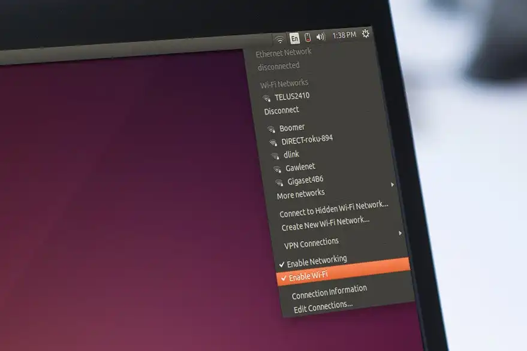
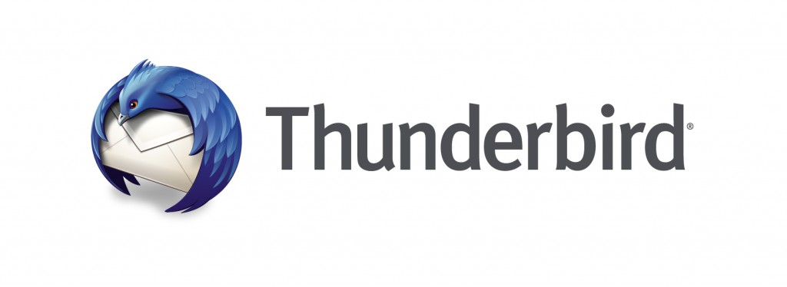
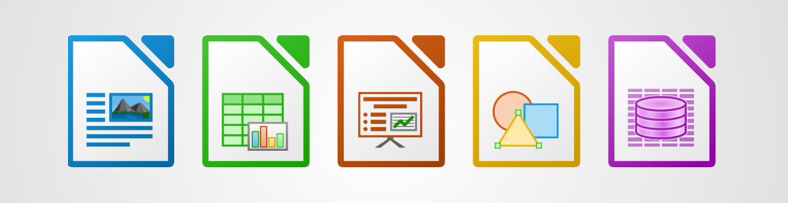
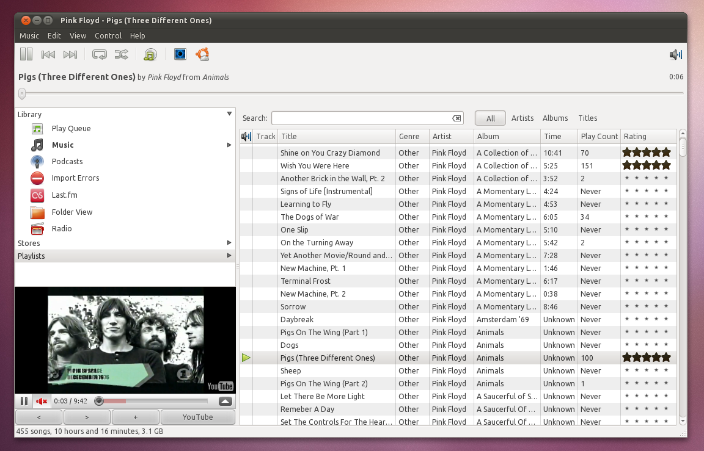
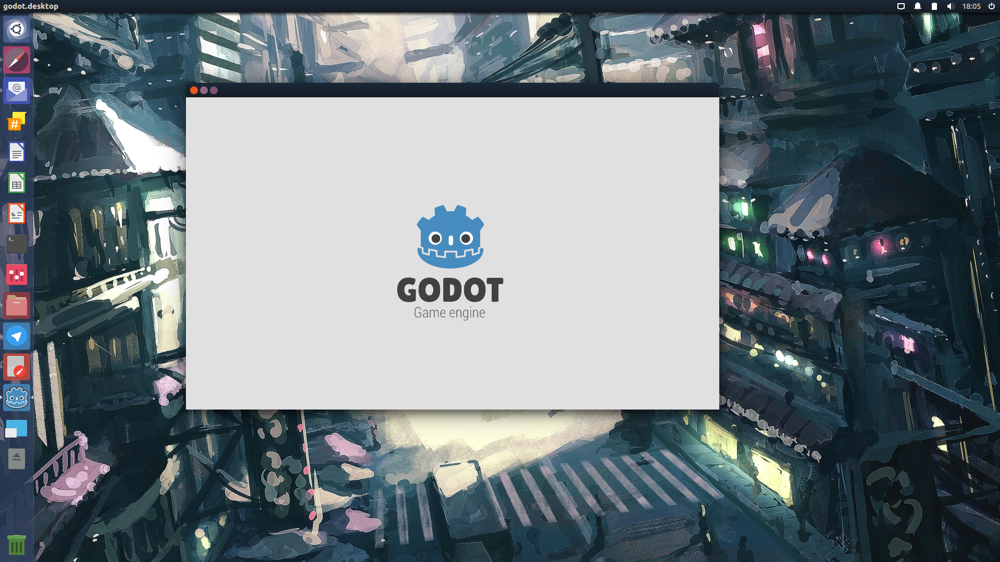
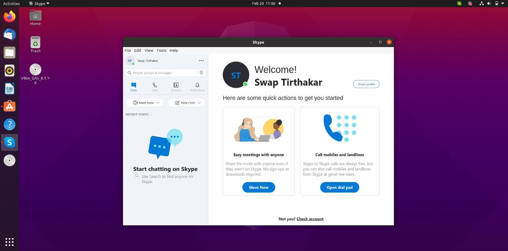
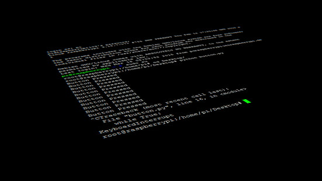

# Deliverable 3

## Connecting Ubuntu to the internet

1. From the right side of the top bar, select "system menu".
2. "Wi-Fi Not Connected" should be selected. The menu's Wi-Fi section will enlarge.
3. Click on "Select Network"
4. Then click "Connect" after selecting network.
5. When prompted, Insert the password to the network connection.
6. As the computer tries to connect to the network, the network icon will change.

## Every day tasks In Ubuntu

### Internet browsing
Ubuntu Web Browser is a lightweight web browser that runs on the Oxide browser engine and incorporates Ubuntu UI components.

Firefox is the default web browser in Ubuntu thanks to its features that make it one of the greatest web browsers available today.Other alternatives for web browsing programs include, Vivaldi, Chromium and Opera which offer things such as a sidebar for quick web application access and unique tab management.

### Reading email
Mozilla has developed Thunderbird, an email client. It's built for speed, security, and simplicity. For Ubuntu 11.10 (Oneiric Ocelot) and beyond, it is the default desktop mail client. It offers features including an RSS reader, as well as support for a number of protocols and web mail clients. The add-ons menu includes functionality like calendar support, as well as Firefox-style add-ons.

### Remote assistance
Ubuntu includes a remote desktop client. This allows you to remotely control your desktop from any computer or mobile device. You'll be able to see what's on the screen, move the mouse, and even type!

**Here are some of the best remote desktop sharing applications for Ubuntu:**

* KDE connect
* VNC connect
* Vinagre

### Office productivity (writing documents, editing spreadsheets and doing presentations)
LibreOffice, an open source office suite that is compatible with Microsoft Office, allows you to create professional documents, spreadsheets, and presentations on Ubuntu. That means you can quickly and simply open and modify files such as Word documents, Excel spreadsheets, and PowerPoint presentations, as well as share them with other people. You can also access Google Docs from your computer.

### Streaming music and video
Ubuntu's default music player is Rhythmbox. Rhythmbox is a popular GTK music player that runs on the Gstreamer backend and is very chevalier. The app's standard interface is easy to navigate, and the column browser or search box make it simple to sort through your music.

**Here are a couple great alternatives for media applications:**

* Clementine
* CMUS
* Spotify
* Audacious

### Video games
Ubuntu is often the target platform for native Linux game developers because it is the world's most popular Linux desktop. It is, nevertheless, the most often used package for ProtonDB testing. We're convinced that playing on Ubuntu will allow you to get the most out of your Steam collection.

**Video Games Development Apps on Ubuntu**

1. GODOT

Because Godot is an open-source and free, you have ultimate ownership over everything you create with it. The engine supports both 3D and 2D games, includes a Python-like scripting language, and can be used on desktop, console, online, and mobile platforms.

2. UNITY

Unity is the most popular game production platform in the world, and it's the basis for many of the top PC and mobile games available today. It's also used for things other than video games. It interfaces with programs like ROS for Robotics as a simulation environment and also serves as a superb training environment for Machine Learning.
 
 **Installing unity using the terminal command lines**

1. Run the following command to add the Unity Hub repository:

* `sudo sh -c 'echo "deb https://hub.unity3d.com/linux/repos/deb stable main" > /etc/apt/sources.list.d/unityhub.list`

2. Add the public signing key:

`wget -qO - https://hub.unity3d.com/linux/keys/public | sudo apt-key add -`

3. Update the package cache and install Unity Hub:

`sudo apt update`
`sudo apt-get install unityhub`

### Video Chatting/calling/conferencing
Ekiga is widely regarded as one of the greatest Linux Voice Over IP applications. In the Linux community, it was previously known as GnomeMeeting. It's a modern-day VoIP and video conferencing solution for GNOME users that's been gaining traction in the open-source community since its creation. To guarantee the communication is as stable as possible, the software uses both the SIP and H.323 protocols. The creators also made the required steps to reduce latency.

### Texting/Instant messaging

Instant messaging on Ubuntu does not differ when it comes to other operating systems. The widely used social media websites and applications work equally on Ubuntu. 

**Here is a list of the most liked/used messaging applications on Ubuntu**

* slack
* wire 
* wickr
* skype 
* telegram 

### Programing

For many reasons, Ubuntu is the finest Linux distribution for developers. The first reason is that several developing technologies such as deep learning, artificial intelligence, and machine learning are supported. Microsoft, Google, and Amazon have all made significant investments in deep learning. The IT companies are investing in the development of dedicated deep learning tools. Because of the numerous libraries, examples, and tutorials, Ubuntu is the finest OS for developers. Unlike any other OS, Ubuntu's features greatly aid AI, machine learning, and deep learning. Ubuntu also offers enough compatibility for the most recent versions of free open source software and platforms. As a result, many well-known frameworks, including as Keras, OpenCV, PyTorch, TensorFlow, and Theano, choose Ubuntu. Another reason to think of Ubuntu as the finest operating system for programming is its AI support. Many recent changes in the AI scene can be attributed to GPUs. NVIDIA's current expenditures in CUDA on Linux are aimed at maximizing the capabilities of their latest graphics hardware. You may now use traditional PCI slots on motherboards or external Thunderbolt adapters to add graphics cards to Ubuntu.

### Educational Applications 
Edubuntu, formerly known as Ubuntu Education Edition, was an official Ubuntu operating system derivative intended for use in classrooms, families, and communities. Edubuntu was created in conjunction with educators and technologists from around the world.

### How to get help with your Ubuntu machine
Sometimes the new environment in an operating system is user-friendly, and we have no trouble interacting with it. However, there are occasions when the new environment is so intricate and odd that we are entirely lost. In this case, we require guidance or assistance from the new environment to help us achieve our objectives. Almost every piece of software or operating system we come across has some type of built-in assistance to assist novice and inexperienced users. When it comes to the Ubuntu terminal or command line interface, there are various ways to seek support.

**The ways to get help from Ubuntu terminal or Command line:**

1. Use the command options –h or –help
2. Use tab completion on the Shell
3. Use the info command *example: `info bash`*
 
## Sources

https://help.ubuntu.com
https://ubuntu.com