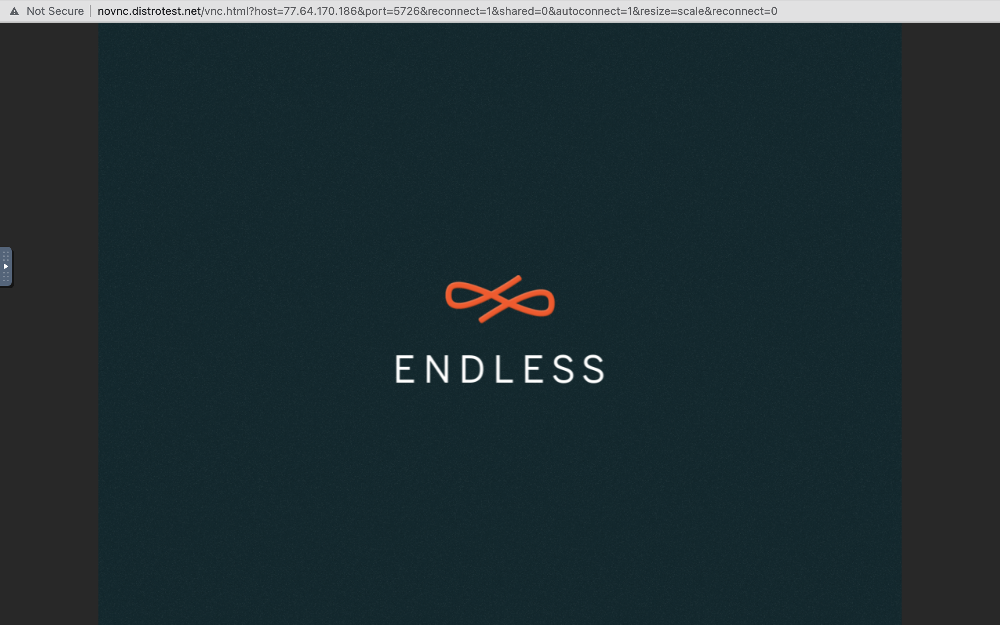
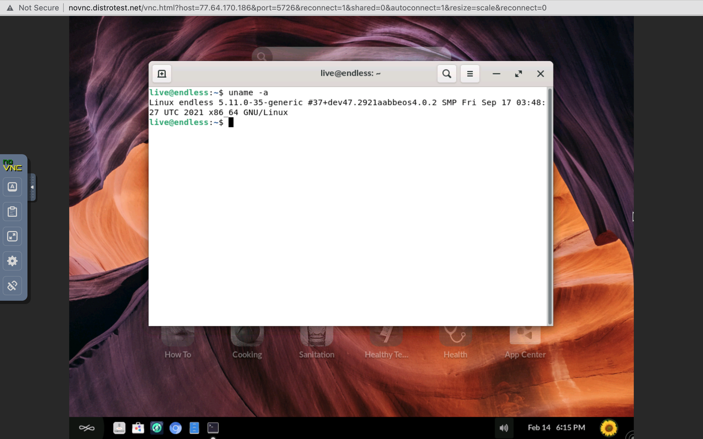
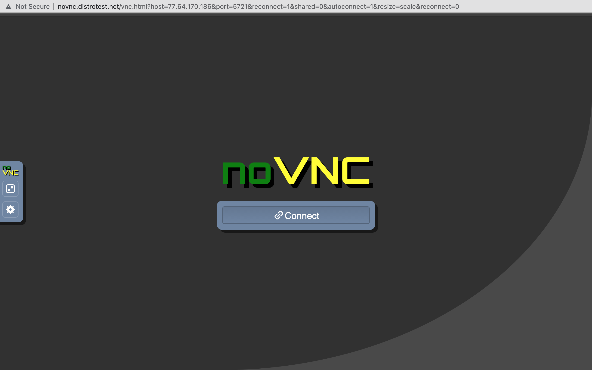

# Exploring Linux distributions

## Question 1
1. What is the OS Type: **Linux**
2. Which major distro is it based on? **Debian**
3. Which processor architecture does it support? **armhf, ppc64el, riscv, s390x, x86_64**
4. Is the distribution active or is it discontinued? **Active**
5. What is the distro’s home page? **https://www.ubuntu.com/**

## Question 2
1. What is the name of the distribution and the OS Type: **Bluestar Linux**
2. Which major distro is it based on? **Arch**
3. Which processor architecture does it support? **x86_64**
4. Is the distribution active or is it discontinued? **Active**
5. What is the distro’s home page? **https://sourceforge.net/projects/bluestarlinux/**

## Question 3
1. What is the name of the distribution? **Neptune**
2. What is the country of Origin? **Germany**
3. What major distribution is it based on? **Debian (stable)**
4. What is the distribution category? **Desktop, Live Medium**
5. Which processor architecture, aside from the one in the original query, does the OS support? **None**

## Question 4
### A Linux distribution used for Data Rescue/Data recovery
| Distro Name   |               Website                | Desktop Environment | 
|---------------|--------------------------------------|---------------------|
|**Kali Linux** |**[Kali Linux](http://www.kali.org/)**|  **Enlightenment, GNOME, KDE Plasma, LXDE, MATE, Xfce**                   |

### A Linux distribution used for Education that supports the ix86 processor architecture.
| Distro Name  | Website | Desktop Environment | 
|--------------|---------|---------------------|
|**Alt Linux** |**[Alt Linux](https://en.altlinux.org/ )**|**AfterStep, Blackbox, Cinnamon, Enlightenment, FVWM, GNOME, IceWM, KDE, LXDE, MATE, Openbox, LXQt, WMaker, Xfce**|

### A Linux distribution that supports the OEM installation method
| Distro Name | Website | Desktop Environment | 
|-------------|---------|---------------------|
|**Xubuntu**  |**[Xubuntu](http://www.xubuntu.org/)**|**Xfce**|

## Question 5
 **I like the idea of how simplistic [DahliaOs](https://dahliaos.io/#features) It allows you to use the containers app to combine your favorite apps even those from other operating systems together in one place, The operating system also allows you to use it on those older as well new supporting hardware. A few of the features that I like are Internet recovery; it allows you to get your work back at any malfunction while operating. Its a free and open source allowing use with all the source codes to be found on the github platform and lastly that it is developer friendly allowing you to run your favorite development softwares.**

## Question 6

