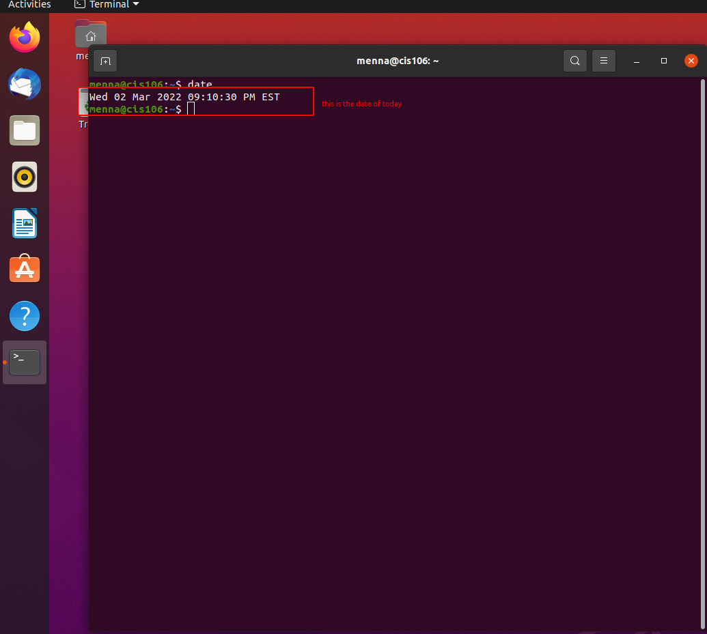
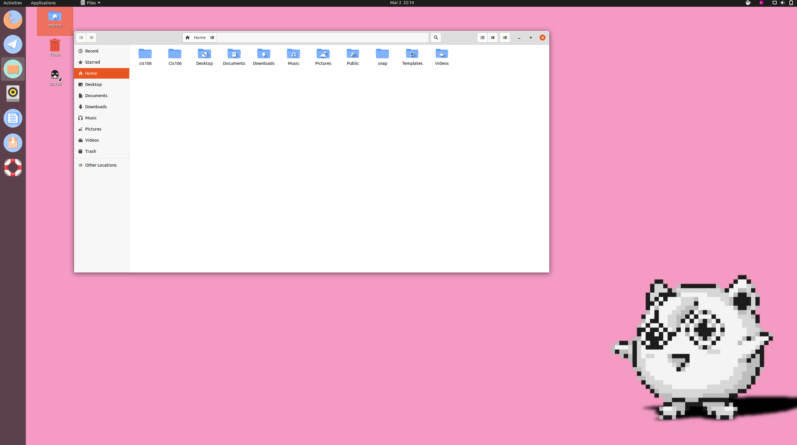
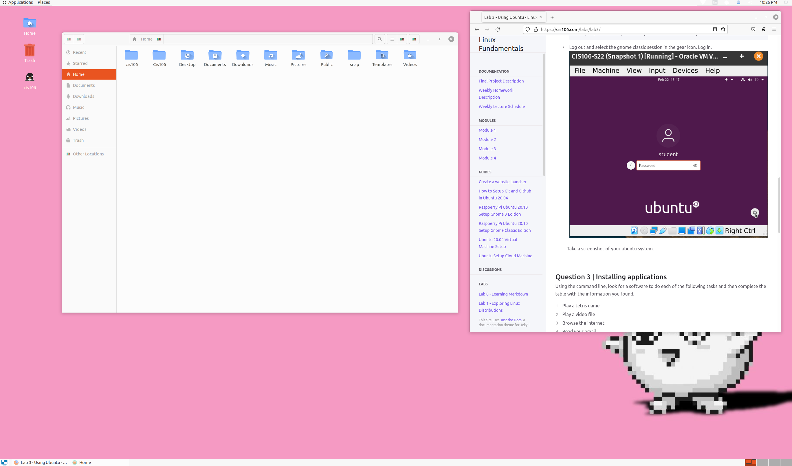

#  Lab 3 Using Ubuntu 

# Question 1

# Question 2

# Question 3
 
 
| Program purpose     | Package Name        | Version      | Description |
| ------------------- | ------------------- | -------------| ----------- |
| Play a tetris game  | quadraprassal       |  1:3.36.0-1  | Tetris game |
| Play a video file   |  Jigdo file         |0.8.0-1build1 |   Jigdo     |
| Browse the internet |  berrynet           | 3.9.0-1      |learn python |
| Read your email     |installation birthday| now 14 all   |birthday msg |
| Play music          |sonic-pi             |2.10.0~repack-2.1build2 amd64|learn coding |
|

Command Answers:
* Sub question 1: "sudo apt install application-name -y"
* Sub question 2: "sudo apt remove application-name -y"
* Sub question 3: "sudo apt install application0name+ application-name- vlc+"

# Question 4

| command | what it does |
|---------|--------------|
| echo    |displays a line of texts              |
| fortune |it prints out a random epigram.           |
| cowsay  |generates an ASCII picture of a cow saying something provided by the user.              |
| lolcat  | a program that concatenates files, or standard input, to standard output (like the generic cat), and adds rainbow coloring to it |
| figlet  | prints its input using large characters|
| toilet  |prints text using large characters made of smaller characters.               |
| rig     |Rig is a utility that will piece together a random first name, last name, street number and address, along with a geographically consistant (ie, they all match the same area) city, state, ZIP code, and area code.|