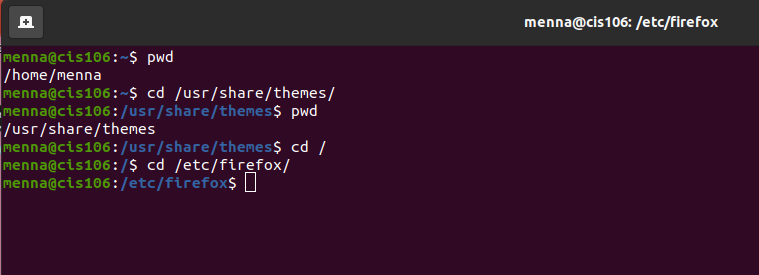

# Lab 4 The Linux File System

## Question 1

### Question 1.1

| Directory | Function           |
|-----------|--------------------|
| bin       | essential commands |
| dev       | device files       |
| etc       | system configuration files |
| home      | user home directions |
| media     | mount point for removable media such as DVD's and floppy disks |
| opt       | add-on software packages |
| proc      | kernel information, process control, system hardware information |
| srv       | information relating to services that run on the system |
| usr       | software not essential for system operation, such as applications |
| var       | dedicated to variable data, such as logs, databases, websites, and temporary spool files that persist from one boot to the next |

### Question 1.2

| Command | What it does | Syntax | An example |
|---------|--------------|--------|------------|
|   pwd   | Displays current working directory |pwd| pwd |
|   cd    | Changes the current working directory |cd + destination | cd/usr/icons/default |
|   ls    | Displays all the files inside a given directory |ls + -a + ~/destination | ls -a  pictures |

### Question 1.3 

### Presentation Practice 1

### Presentation Practice 2

### Presentation Challenge

## Question 2

### 2.1 Absolute path

### 2.2 Relative path

## Question 3

## Question 4

## Question 5

