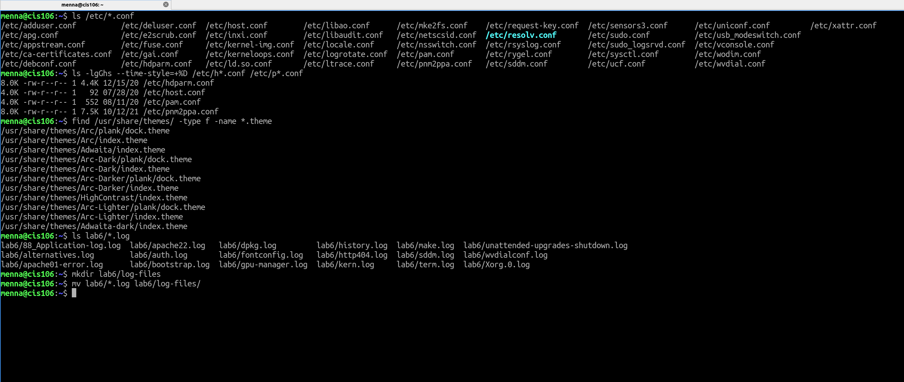
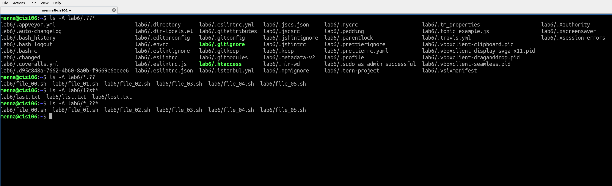
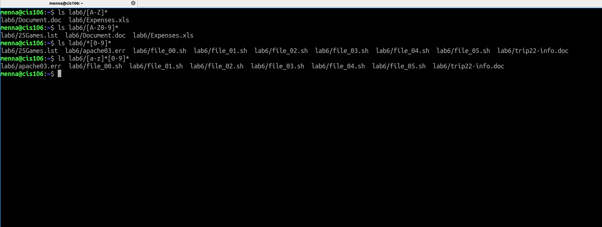
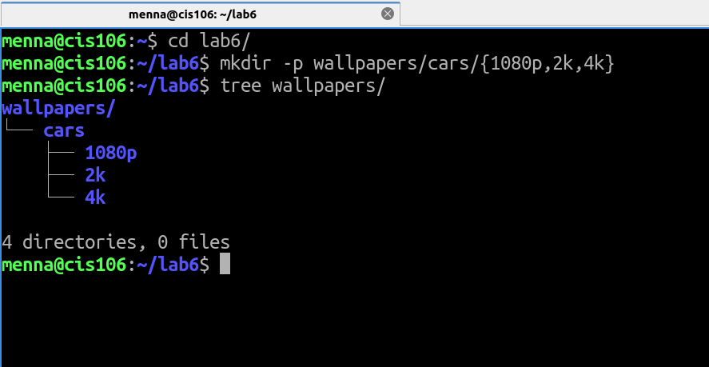
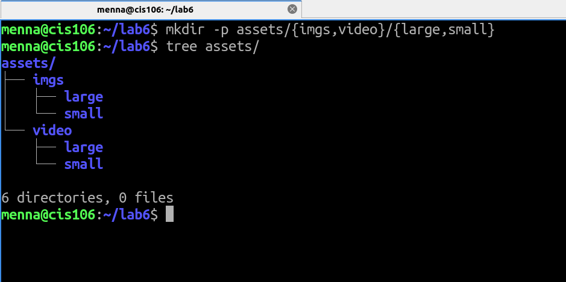
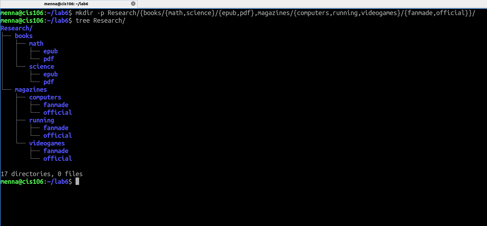
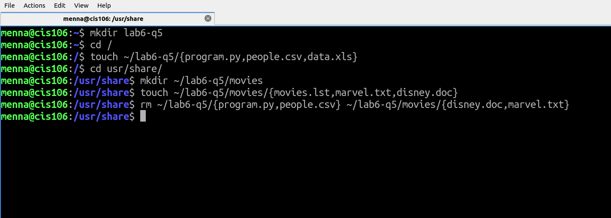
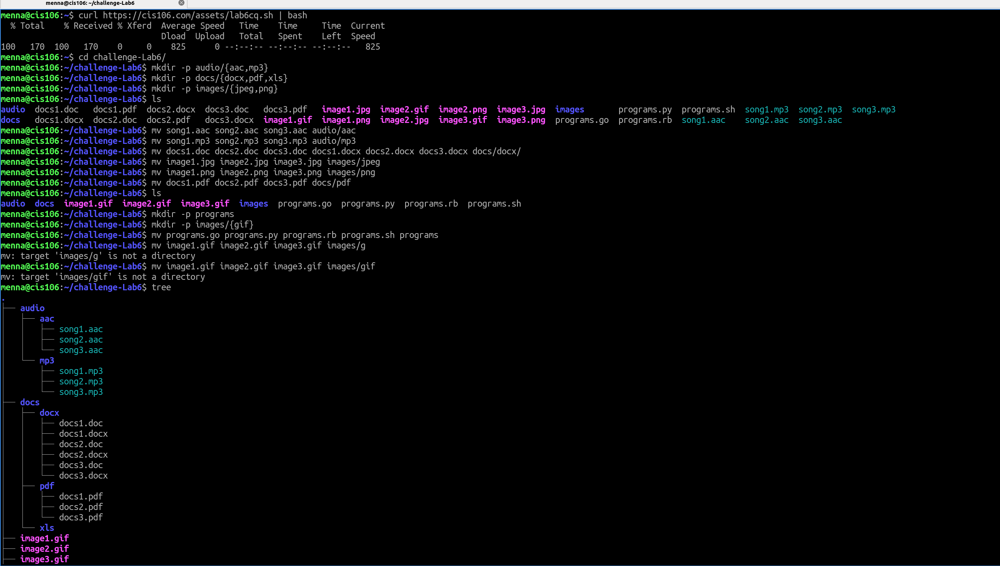
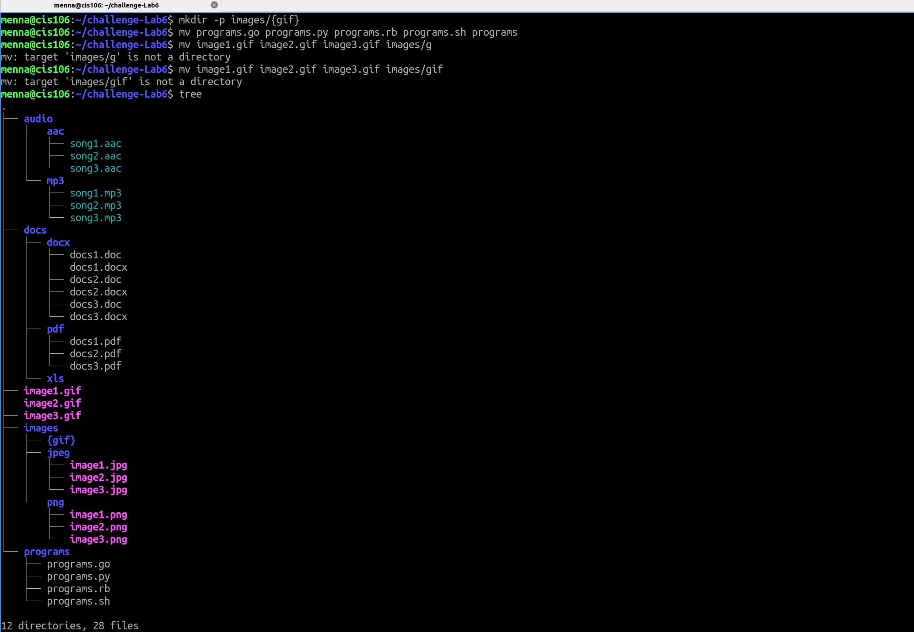

# Lab6: File Globing/wildcards

## Question 1 

## Question 2

## Question 3

## Question 4 

### Problem 1

### Problem 2

### Problem 3 

### Problem 4

### Problem 5 

## Challenge Question

