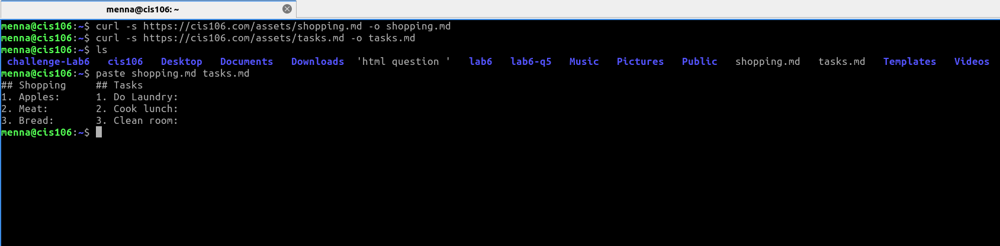
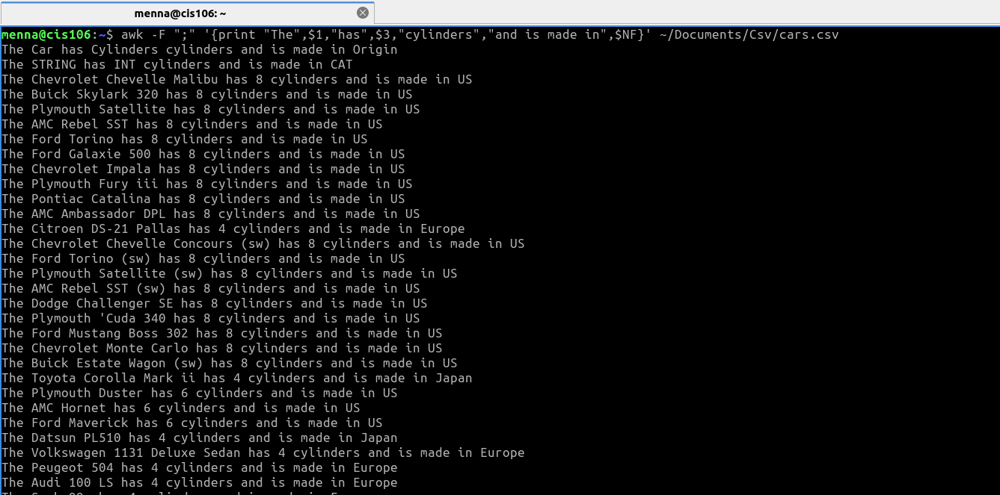
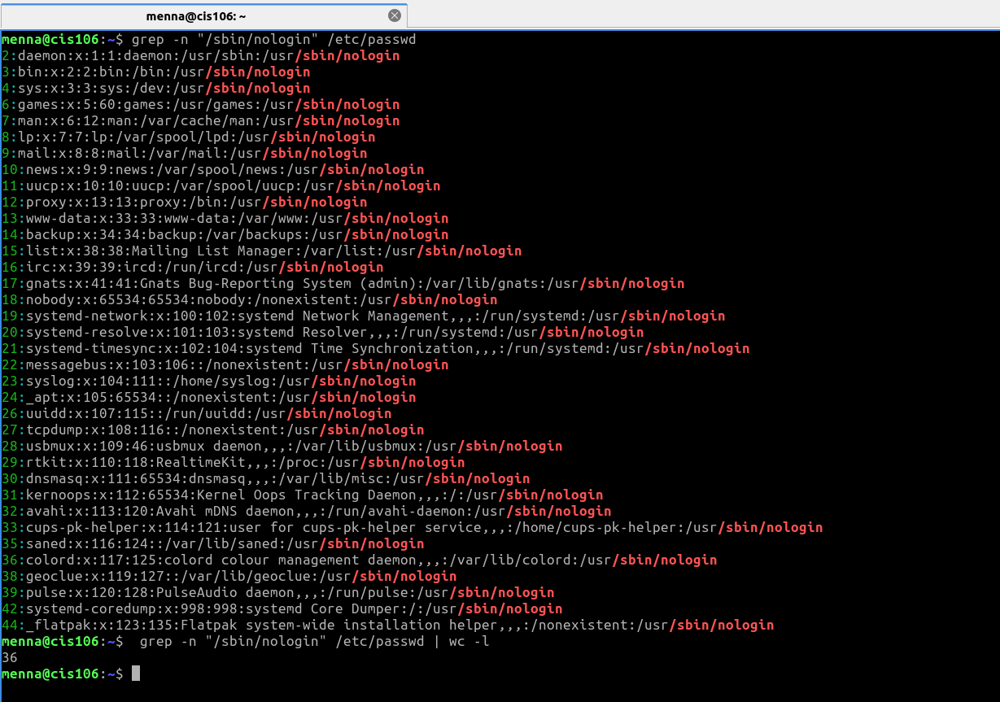

# Lab7: Handling Files

# Question 1

## Q1.1

## Q1.2

## Q1.3

## Q1.4 

## Q1.5

# Question 2

## Q2.1

## Q2.2

## Q2.3

## Q2.4

# Question 3

## Q3.1

## Q3.2

## Q3.3

## Q3.4

# Question 4

## Q4.1

## Q4.2

## Q4.3

## Q4.4

## Q4.5

# Question 5

## Q5.1

## Q5.2

## Q5.3

## Q5.4

## Q5.5

## Q5.6

## Q5.7

## Q5.8

# Question 6 

## Q6.1

## Q6.2

## Q6.3

## Q6.4
