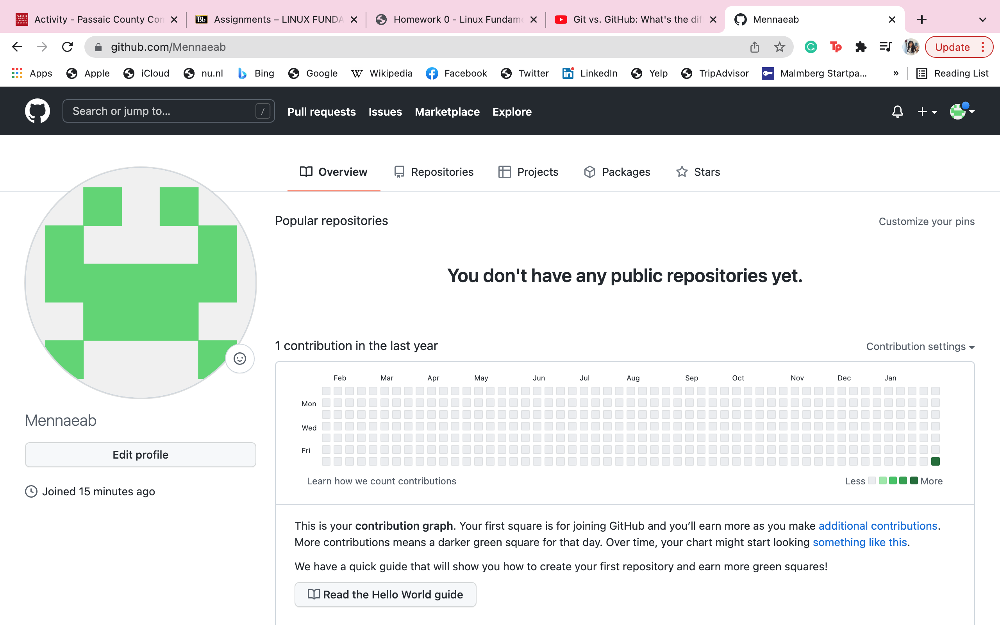

# Week Report 0

## Summary of Presentation: Introduction to CIS 106
In this week’s presentation we have gone over the course prerequisites including understanding basic computer literacy and how to prepare our learning environments well as why we should learn linux.

## My Github account

## Final Project Research: Pick a Project

For the final project I picked, Building a portable hacking machine with a Raspberry Pi and Kali Linux.