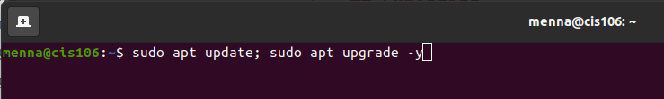

# Week report 3

## Summary of presentations

In this week's lecture we learned about GUI and installing the linux software

## Exploring Desktop Environments

### bulleted list of different desktop environments

* Gnome
* Budgie
* Cinnamon 

### Definitions for the following terms:

**GUI**: Is the graphical environment of your operating system.
**DE**: Stands for "Desktop Environment". It is an implementation of the desktop metaphor made of a bundle of program. 

### Bulleted list of the common elements of a desktop environment

* Launcher
* Widgets
* Dashboards
* Menu
* Panels
* Window manager

## The bash Shell

What is a shell? A shell provides an interface to the system. It is a command line interpreter.

#### List different shells
* Bourne shell
* Bash shell
* Korn shell

#### List some bash shortcuts (no more than 10 and no less than 5)
* Ctrl + y
* Alt + u
* Ctrl + _
* Ctrl + o
* Esc + t
* Alt + .
* Ctrl + g

#### List basic commands and their usage

* ls - list directory contents
* echo - prints text to the terminal window
* mkdir - create a directory
* cd - change directory
* locate - locate a specific file or directory
* cat - read a file, create a file, and concatenate files
* exit - exit out of directory

## Managing Software

* Command for updating ubuntu: **sudo apt update; sudo apt upgrade**
* Command for installing software: **sudo apt install package-name**
* Command for removing software: **sudo apt get remove software-name**
* Command for searching for software: **sudo apt cache search software-name**

## Definition of the following terms:

* Package: Archives that contain binaries of software, configuration files, and information about dependencies.
* Library: Reusable code that can be used by more than one function or program.
* Repository: A large collection of software available for download.

### screenshot of how to update ubuntu with its explanation 

 **Sudo** allows the run of any command as root user, **Apt** is a program that I use to manage the software and updates, **Update** allows the download of package information from all configured sources, using **";"** you can run multiple commands in a single line, and the **"-y"** serves as the confirmation to a command, it is optional but once 100% sure about an upgrade it is usable. 
